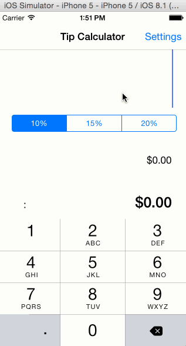

This is an Android demo application for displaying the total amount with tip amount. 

Time spent: 2 hours spent in total

Completed user stories:

Required: User can input the total bill amount.
Required: User can click on a predetermined percentages for tip.
Required: User can view total bill amount.

Notes:

The tutorial is on a different version of xcode which makes following it somewhat difficult. 

Walkthrough of all user stories:

GIF created with [LiceCap](http://www.cockos.com/licecap/).
